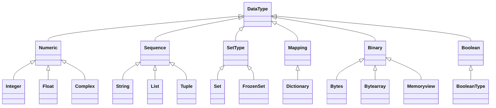

Python is a high-level, interpreted programming language created by Guido van Rossum and first released in 1991. It's known for its clear syntax, readability, and versatility. Key characteristics include:

1. **Interpreted**: Python code is executed line by line, rather than compiled ahead of time.

2. **Dynamic** typing: Variable types are determined at runtime.

3. **Object-oriented**: Supports object-oriented programming paradigms.

4. **High-level**: Abstracts many low-level details, making it easier to use.

5. **Open-source**: Free to use and distribute, with a large community contributing to its development.


### **Python's Usage**

Python is widely used across various domains due to its versatility and extensive library support. Here are some key areas where Python excels:

&nbsp;

#### **Web Development**

- `Django`: Full-stack framework for building complex web applications

- `Flask`: Lightweight framework for smaller applications and microservices

- `FastAPI`: Modern, fast framework for building APIs

- `Pyramid`: Flexible framework for large applications

- `Tornado`: Asynchronous networking library and web framework

&nbsp;Usage:

- Backend development (server-side logic)
- RESTful API creation
- Content Management Systems (CMS)
- E-commerce platforms
- Social media platforms

&nbsp;

#### **Data Science and Machine Learning**

- `NumPy`: Numerical computing

- `Pandas`: Data manipulation and analysis

- `Matplotlib` and `Seaborn`: Data visualization

- `Scikit-learn`: Machine learning algorithms

- `TensorFlow` and `PyTorch`: Deep learning frameworks

- `Keras`: High-level neural network API

- `XGBoost`: Gradient boosting framework

&nbsp;Usage:

- Predictive modeling
- Data cleaning and preprocessing
- Statistical analysis
- Time series analysis
- Image and speech recognition
- Natural Language Processing (NLP)

&nbsp;

#### **Artificial Intelligence**

- `NLTK (Natural Language Toolkit)`: NLP tasks

- `spaCy`: Advanced NLP

- `OpenCV`: Computer vision and image processing

- `TensorFlow` and `PyTorch`: Deep learning and neural networks

- `Gym`: Reinforcement learning

&nbsp;Usage:

- Chatbots and conversational AI
- Sentiment analysis
- Object detection and facial recognition
- Autonomous systems
- Recommendation systems

&nbsp;

#### Scientific Computing

- `SciPy`: Scientific and technical computing

- `SymPy`: Symbolic mathematics

- `Astropy`: Astronomy

- `Biopython`: Computational biology and bioinformatics

&nbsp;Usage:

- Physics simulations
- Astronomy data analysis
- Bioinformatics research
- Chemical modeling

&nbsp;

#### Automation and Scripting

- `Ansible`: IT automation

- `Fabric`: Application deployment and systems administration tasks

- `Beautiful Soup`: Web scraping

- `Scrapy`: Large scale web scraping

- `Selenium`: Web browser automation

&nbsp;Usage:

- System administration tasks
- Automated testing
- Data extraction from websites
- Process automation in various industries

&nbsp;

#### Game Development

- `Pygame`: 2D game development

- `Panda3D`: 3D game engine and framework

- `Arcade`: Modern Python framework for crafting games

&nbsp;Usage:

- 2D and 3D game creation
- Educational games
- Game prototyping

&nbsp;

#### De**sktop Applications**

- `PyQt` and `PySide`: Cross-platform application development

- `Tkinter`: Standard Python interface to the Tk GUI toolkit

- `wxPython`: wxWidgets wrapper for Python

&nbsp;Usage:

- Cross-platform software development
- Custom business applications
- Graphical tools and utilities

&nbsp;

#### Network Programming

- `Scapy`: Packet manipulation

- `Paramiko`: SSH2 protocol library

- `Twisted`: Event-driven networking engine

&nbsp;Usage:

- Network automation
- Building network servers and clients
- Protocol implementation
- Network security tools

&nbsp;

#### Cybersecurity

- `Nmap`: Network discovery and security auditing

- `Wireshark`: Network protocol analyzer

- `Metasploit`: Penetration testing framework

&nbsp;Usage:

- Penetration testing
- Vulnerability assessment
- Malware analysis
- Security auditing

&nbsp;

#### Internet of Things (IoT)

- `Paho`: MQTT client library

- `MicroPython`: Python for microcontrollers

- `Adafruit CircuitPython`: Python for hardware

&nbsp;Usage:

- Embedded systems programming
- Sensor data collection and analysis
- Home automation
- Industrial IoT applications

&nbsp;

#### Finance and Trading

- `Quantopian`: Algorithmic trading

- `Zipline`: Algorithmic trading library

- `PyAlgoTrade:` Algorithmic trading library

- `TA-Lib`: Technical analysis library

&nbsp;Usage:

- Algorithmic trading strategies
- Financial modeling
- Risk assessment
- Portfolio optimization

&nbsp;

#### Education

- `JupyterLab`: Interactive development environment

- `Anaconda`: Distribution of Python for scientific computing

- `Coursera`, `edX`: Online learning platforms with Python courses

&nbsp;Usage:

- Teaching programming concepts
- Data science education
- Interactive textbooks and tutorials

&nbsp;

#### Prototyping and Rapid Development Tools

- `IPython`: Enhanced interactive Python shell

- `Jupyter Notebooks`: Web-based interactive computational environment

&nbsp;Usage:

- Quick proof-of-concept development
- Data exploration and visualization
- Collaborative coding and sharing ideas

&nbsp;

**Big Data Processing Tools and Frameworks**

- `Apache Spark (PySpark)`: Large-scale data processing

- `Dask`: Flexible library for parallel computing

- `Apache Airflow`: Workflow management platform

&nbsp;Usage:

- Distributed computing
- ETL (Extract, Transform, Load) processes
- Big data analytics

&nbsp;

#### Cloud Computing

- `AWS SDK for Python (Boto3)`: Amazon Web Services

- `Google Cloud Client Library`: Google Cloud Platform

- `Azure SDK for Python`: Microsoft Azure

&nbsp;Usage:

- Cloud infrastructure management
- Serverless computing
- Cloud-based application development

This comprehensive list showcases Python's versatility across numerous sectors. Its rich ecosystem of libraries and frameworks makes it a go-to language for a wide range of applications, from simple scripts to complex, enterprise-level systems. The language's flexibility and community support ensure that new tools and libraries are constantly being developed, further expanding Python's capabilities and use cases.

Python's popularity stems from its ease of use, extensive library ecosystem, and ability to integrate with other languages and tools. Its "batteries included" philosophy, meaning it comes with a comprehensive standard library, makes it suitable for a wide range of tasks right out of the box.

The language's flexibility allows it to be used in projects of all sizes, from simple scripts to large, complex systems. This versatility, combined with its active community and continuous development, ensures Python remains a relevant and powerful tool in the programming world.

&nbsp;

**Download Python from this site :**  [Download](https://www.python.org/downloads/)

&nbsp;

#### Integrated Development Environments (IDEs)

- `PyCharm`: Full-featured, professional IDE

- `VS Code`: Lightweight, extensible editor with strong Python support

- `Sublime Text`: Fast, customizable text editor (requires setup for Python)

&nbsp;

#### REPL: Read-Eval-Print Loop

REPL stands for Read-Eval-Print Loop. It's an interactive programming environment that:

- Reads user input
- Evaluates the input
- Prints the result
- Loops back to read the next input

This interactive mode allows users to execute Python code one line at a time

```python
 >>> x = 10
>>> y = 5
>>> x + y
15
>>> x * y
50
```

&nbsp;

### **Python Interpreter**

The Python interpreter is a program that reads and executes Python code. It's the core component that allows Python to be an interpreted language, meaning that code can be executed directly without needing to be compiled into machine code first.

| Aspect                | Interpreter                                          | Compiler                                          |
| --------------------- | ---------------------------------------------------- | ------------------------------------------------- |
| Execution Method      | Translates and executes code line by line            | Translates entire source code before execution    |
| Output                | Directly executes the interpreted code               | Produces an executable file                       |
| Execution Speed       | Generally slower for larger programs                 | Generally faster for larger programs              |
| Memory Efficiency     | Often more memory-efficient                          | May use more memory (separate executable)         |
| Error Detection       | Reports errors line by line during execution         | Reports all errors after analyzing entire code    |
| Debugging             | Easier, stops at first error                         | Can be more complex, all errors reported together |
| Platform Independence | More portable, interpreter handles machine specifics | Often platform-specific executables               |
| Development Cycle     | Faster, immediate testing of changes                 | Longer, requires recompilation after changes      |
| Runtime Requirements  | Needs interpreter present to run                     | Executable runs independently                     |
| Optimization          | Limited, line-by-line optimization                   | Extensive optimization possible                   |
| Flexibility           | More flexible for dynamic languages                  | Better for performance-critical applications      |
| Distribution          | Typically source code or bytecode                    | Compiled executables                              |
| Examples              | Python, Ruby, JavaScript                             | C, C++, Rust, Go                                  |
| Use Cases             | Scripting, rapid prototyping, frequent changes       | System programming, performance-critical apps     |

&nbsp;

#### How the Python Interpreter Works:

Lexical Analysis:

- Breaks down the source code into tokens (smallest units of meaning in the language).

Parsing:

- Analyzes the structure of the code according to the grammar rules of Python.
- Creates an **Abstract Syntax Tree (AST)** representation of the code.

Compilation to Bytecode:

- Converts the AST into Python bytecode.
- This step is usually invisible to the programmer.

Execution by PVM:

- The **Python Virtual Machine** executes the bytecode.

The Python interpreter is fundamental to Python's philosophy of simplicity and readability. It allows for a smooth development process, from writing and testing small code snippets to running complex applications.

&nbsp;

### indentation in Python

- Python uses indentation to define code blocks, unlike many languages that use braces {}
- Typically, 4 spaces are used for each indentation level
- Consistent indentation is crucial for correct code execution

Example:

```python
if True:
    print("This is indented")
    if True:
        print("This is further indented")
print("This is not indented")
```

&nbsp;

### **Comments in Python**

- Single-line comments start with #
- Multi-line comments use triple quotes """ or '''

```python
# This is a single-line comment

"""
This is a
multi-line comment
"""
```

&nbsp;

### Data types

Data types in Python refer to the different kinds of values that can be stored and manipulated in a program. Each data type defines the operations that can be performed on the values and the way they are stored in memory.



**type() function**

The `type` function in Python is used to determine the type of an object. It can be used to return the type of any object (like integer, list, string, etc.). This function is particularly useful for debugging and understanding the types of variables you're working with in your program.

**Integers**

Integers are whole numbers, which can be positive or negative, including zero. They are used to represent discrete values without any fractional or decimal component.

```python
x = 5
y = -3
z = 0

print(f"x: {x}, y: {y}, z: {z}")
print(f"Type of x: {type(x)}, Type of y: {type(y)}, Type of z: {type(z)}")
```

**Floating-point numbers**

Floating-point numbers are numbers that have a decimal point. They are used to represent real numbers with precision. They can also represent very large or very small numbers using scientific notation.

```python
y = 3.14
z = -2.718
scientific = 1.23e4  # 1.23 * 10^4

print(f"y: {y}, z: {z}, scientific: {scientific}")
print(f"Type of y: {type(y)}, Type of z: {type(z)}, Type of scientific: {type(scientific)}")
```

**Strings**

Strings are sequences of characters enclosed in single quotes ('') or double quotes (""). They are used to represent text data. Strings in Python are immutable, meaning that once created, their values cannot be changed.

```python
name = "Alice"
greeting = 'Hello, World!'

print(f"name: {name}, greeting: {greeting}")
print(f"Type of name: {type(name)}, Type of greeting: {type(greeting)}")
```

**Booleans**

Booleans represent one of two values: True or False. They are used in logical operations and control flow statements. The keywords for booleans are `True` and `False`.

```python
is_active = True
is_student = False

print(f"is_active: {is_active}, is_student: {is_student}")
print(f"Type of is_active: {type(is_active)}, Type of is_student: {type(is_student)}")
```

**Complex Numbers**

Represents numbers with real and imaginary parts. Use case: Mathematical calculations involving complex numbers.

```python
z = 3 + 4j
print(f"Complex number: {z}")
print(f"Real part: {z.real}, Imaginary part: {z.imag}")
print(f"Magnitude: {abs(z)}")
```

#### **List**

- **Description**: Ordered collection of items which can be of different types.

- **Use Case**: Storing a sequence of items.

```python
numbers = [1, 2, 3, 4, 5]
print(f"List: {numbers}")
print(f"Type of numbers: {type(numbers)}")
```

#### **Tuple**

- **Description**: Ordered collection of items similar to lists but immutable.

- **Use Case**: Storing a sequence of items that should not be changed.

```python
coordinates = (10.0, 20.0)
print(f"Tuple: {coordinates}")
print(f"Type of coordinates: {type(coordinates)}")
```

#### **Dictionary**

- **Description**: Unordered collection of key-value pairs.

- **Use Case**: Storing data that associates keys with values.

```python
person = {"name": "Alice", "age": 30}
print(f"Dictionary: {person}")
print(f"Type of person: {type(person)}")
```

#### **Set**

- **Description**: Unordered collection of unique items.

- **Use Case**: Storing a collection of unique elements.

```python
immutable_numbers = frozenset([1, 2, 3, 4, 5])
print(f"Frozen Set: {immutable_numbers}")
print(f"Type of immutable_numbers: {type(immutable_numbers)}")
```

#### **Frozen Set**

- **Description**: Immutable version of a set.

- **Use Case**: Storing a collection of unique elements that should not be changed.

```python
immutable_numbers = frozenset([1, 2, 3, 4, 5])
print(f"Frozen Set: {immutable_numbers}")
print(f"Type of immutable_numbers: {type(immutable_numbers)}")
```

#### **Bytes**

- **Description**: Immutable sequence of bytes.

- **Use Case**: Handling binary data.

```python
data = b"hello"
print(f"Bytes: {data}")
print(f"Type of data: {type(data)}")
```

#### **Bytearray**

- **Description**: Mutable sequence of bytes.

- **Use Case**: Handling binary data that can be modified.

```python
mutable_data = bytearray(b"hello")
print(f"Bytearray: {mutable_data}")
print(f"Type of mutable_data: {type(mutable_data)}")
```

#### **Memoryview**

- **Description**: Memory view objects allow Python code to access the internal data of an object that supports the buffer protocol without copying.

- **Use Case**: Handling large data buffers more efficiently.

```python
view = memoryview(bytearray(b"hello"))
print(f"Memoryview: {view}")
print(f"Type of view: {type(view)}")
```

&nbsp;

<SwmMeta version="3.0.0" repo-id="Z2l0aHViJTNBJTNBZGV2LWRvY3MtY29sbGVjdGlvbiUzQSUzQWFycGl0cGFyZWto" repo-name="dev-docs-collection"><sup>Powered by [Swimm](https://app.swimm.io/)</sup></SwmMeta>
